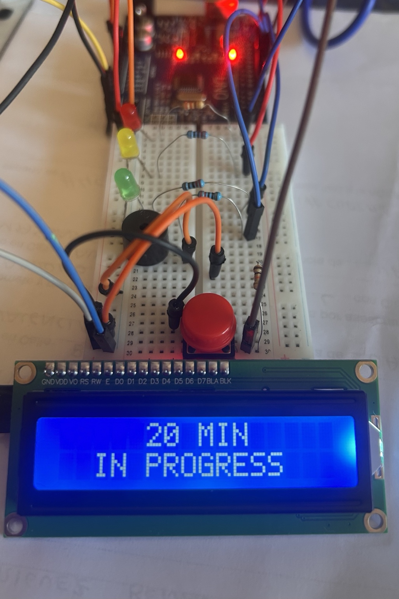

## Arduino-Productivity-Timer

Arduino-based productivity timer that utilizes visual (LEDs) and audio (buzzer) feedback to signal time intervals. The system is designed to support time management during focused tasks, with configurable durations and customizable messages displayed on an I2C LCD.

Project Preview

  

Features

- 20 / 40 / 60 minute intervals (configurable)
- LCD I2C display (16x2)
- Visual feedback via LEDs (customizable)
- Audio feedback via buzzer
- Button-controlled restart
- Motivational message system

Wiring

- SDA → A4 (Arduino Uno)
- SCL → A5 (Arduino Uno)
- LED 20 min → Pin 9  
- LED 40 min → Pin 10  
- LED 60 min → Pin 11  
- Buzzer → Pin 8  
- Button → Pin 7 

How it works

The system runs three timed intervals (20, 40, and 60 minutes).

At each stage, the user receives:
- Visual feedback (LEDs)
- Audio feedback (buzzer)
- Motivational messages on the LCD

At the end of the cycle, the user can restart the process using a push button.
